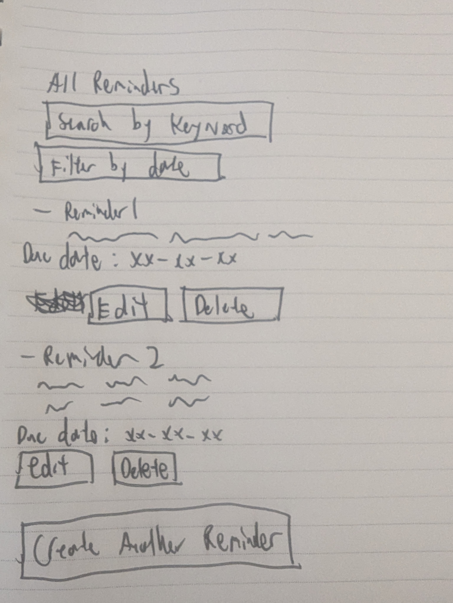
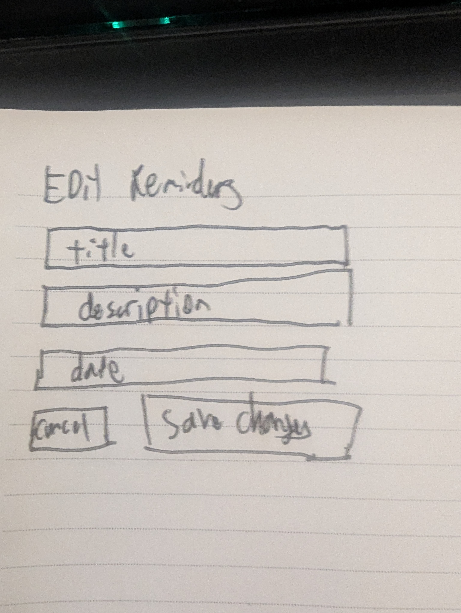
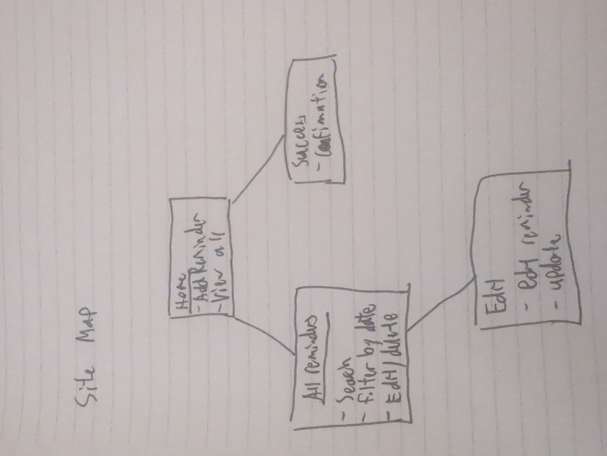

[](https://classroom.github.com/open-in-codespaces?assignment_repo_id=19371907)
# Reminder App

# Tim Han Yu Wang 

## Overview

The Reminder app is a web application that allows user to create and view reminders. Also has the function to search by keywords in reminder name or description, filter by date, and delete or snooze(by 1 day) personal reminders. The reminders are stored with firebase in firestore and updates accordingly with edits, deletions, and snoozes.

The application uses Firebase Firestore as a backend to persist reminder data and React.js for the frontend UI. It is deployed and runnable directly inside GitHub Codespaces using Vite for hot-reloading development.

## Data Model

The app stores reminders in Firebase Firestore. Each reminder includes:

* `title` - a short title for the reminder
* `description` - a longer description of the reminder
* `date` - the due date for the reminder
* `createdAt` - a timestamp of when the reminder was created

**Example Reminder Document:**

```javascript
{
  title: "Finish AIT Final project",
  description: "FINISH THE PROJECT TIM!",
  date: "2025-04-29",
  createdAt: Timestamp
}
```

## Wireframes

(__TODO__: wireframes for all of the pages on your site; they can be as simple as photos of drawings or you can use a tool like Balsamiq, Omnigraffle, etc.)

/ - page for creating a reminder or viewing all reminders made


/AllReminders - page for showing all reminders



/edit - page for editing reminders



## Site map



## User Stories or Use Cases

1. as a user, I can create a reminder by filling out a form with a title, description, and due date
2. as a user, I can view all the reminders created
3. as a user, I can search all the reminders by key words in the title or description
4. as a user, I can filter all the reminders I've made by due dates
5. as a user, I can edit any reminders I've made and update the changes
6. as a user, I can delete any reminders that I no longer need
7. as a user, I can snooze a reminder, pushing the due date back by one day each time I snooze

## Research Topics

* (6 points) Use React.js for the frontend framework
    
* (3 points) Use Vite for the build tool for the React app

* (2 points) Integrate ESLint using Vite's plugin system

*(2 points) Use Firebase firestore to store all reminder data with realtime updates server and user side

13 points total out of 10 required points


## [Link to Initial Main Project File](src/main.jsx) 

Main React entry file where the application initializes React, sets up routing using React Router, and mounts the app to the DOM.


